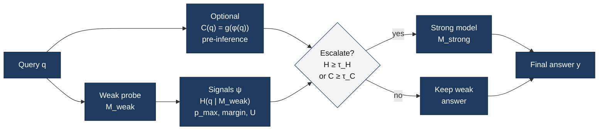

# Figure 1 — Unsupervised LLM routing (method)

Analogous to Sawant’s *confidence pipeline* (Tier-1 call → entropy/confidence gate → serve / escalate), adapted to our formulation: **no preference labels**; thresholds on **calib**; weak-model probe defines \(H\) / \(p_{\max}\).

**Raster:** `fig1_unsupervised_routing_method.png`

## Editable diagram (Mermaid)

## Mapping to the Medium figure

| Sawant (confidence pipeline) | Our figure |
|------------------------------|------------|
| Tier-1 model call + logprobs | Weak probe \(M_{\mathrm{weak}}\) |
| Entropy / confidence scorer | \(\psi\): \(H\), \(p_{\max}\), margin, \(U\) |
| Confidence gate (3 zones) | Binary escalate gate \(\tau_H\) / \(\tau_C\) (calib) |
| Direct serve | Keep weak answer |
| Verify / escalate | Call \(M_{\mathrm{strong}}\) |
| (not in their fig) | Optional pre-inference \(C(q)\) |

We use a **binary** weak↔strong pool (paper scope) rather than three dispatch zones; the structure is the same: cheap probe → uncertainty → gate → serve or escalate.
